# Securing-and-sharing-Files
Normally every programmer deals with transferring of files. So, the problems they might face is hacking of data, a time delay due to transmission of data, copy of garbled data, etc. In this system we have provided a set of great utilities to the users such as: 
1. File Encryption/Decryption 
2. File Splitter/Merger 
3. File Comparison

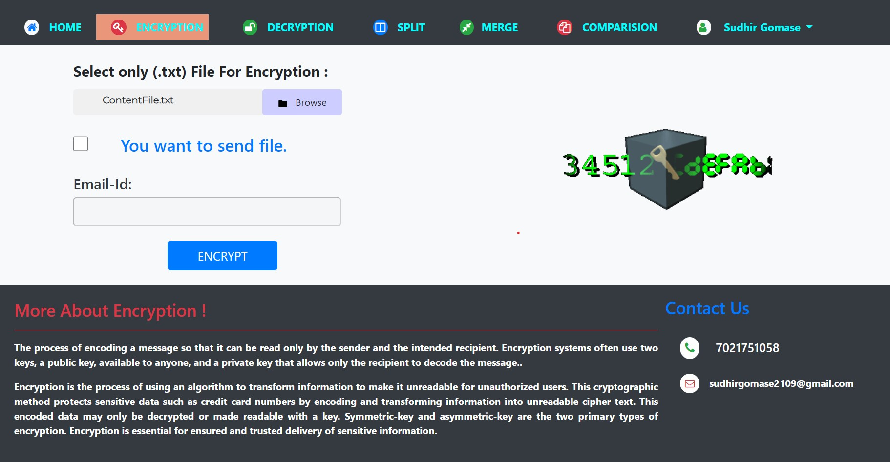

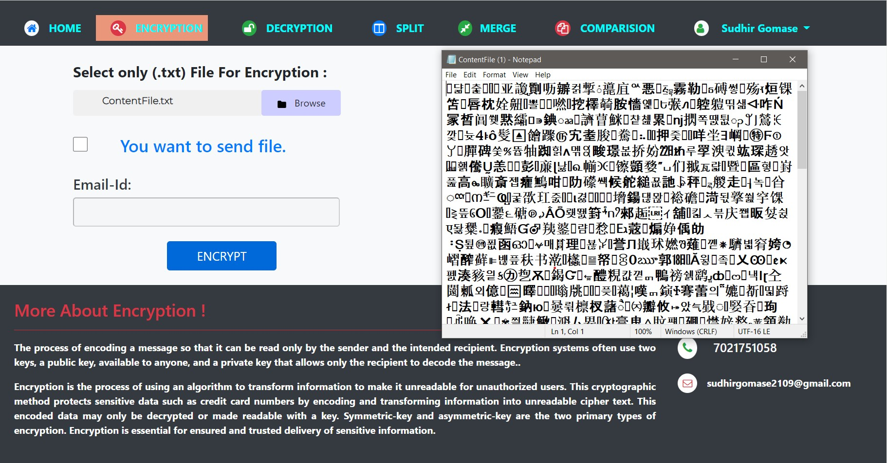

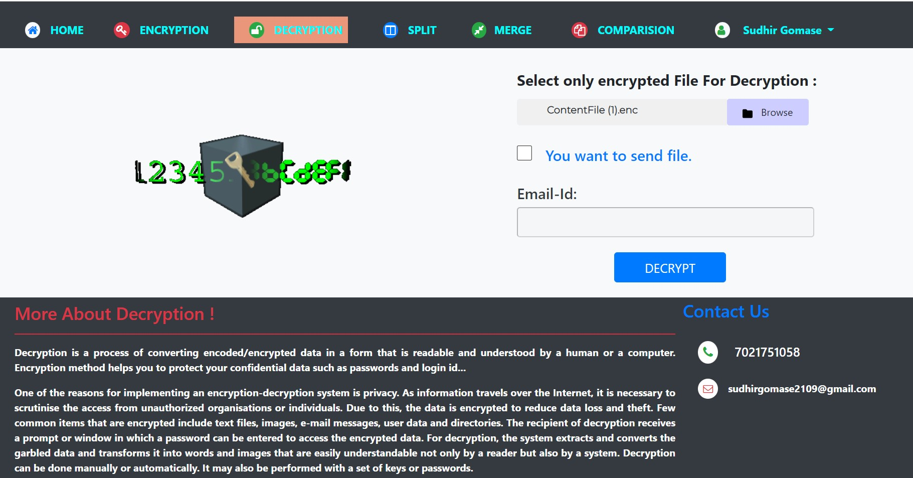

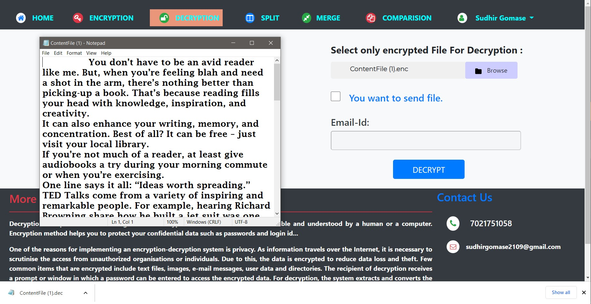

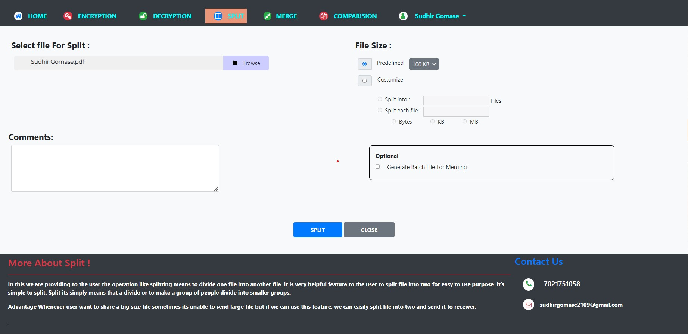

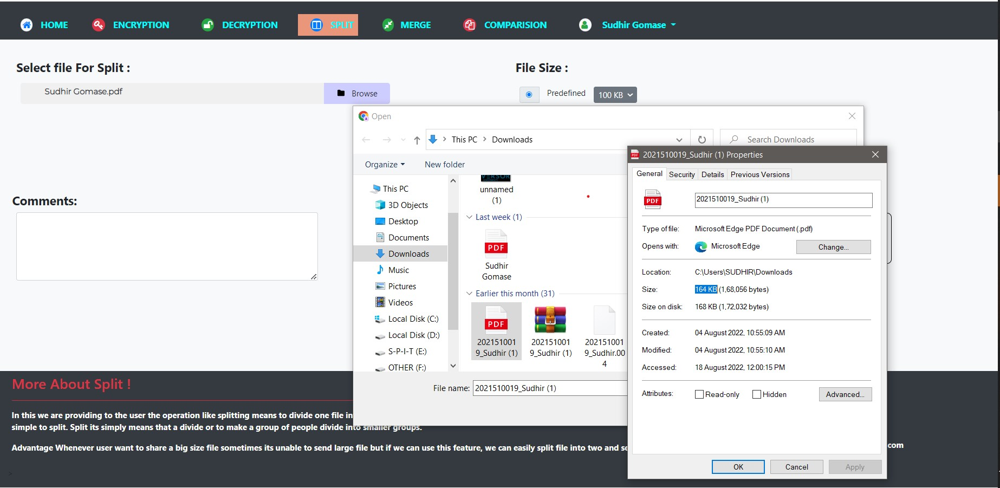

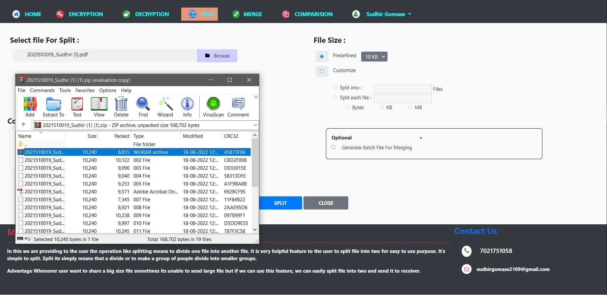

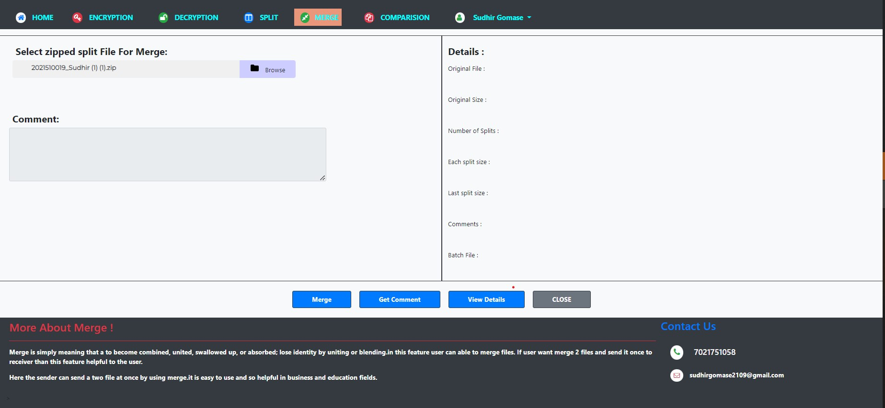

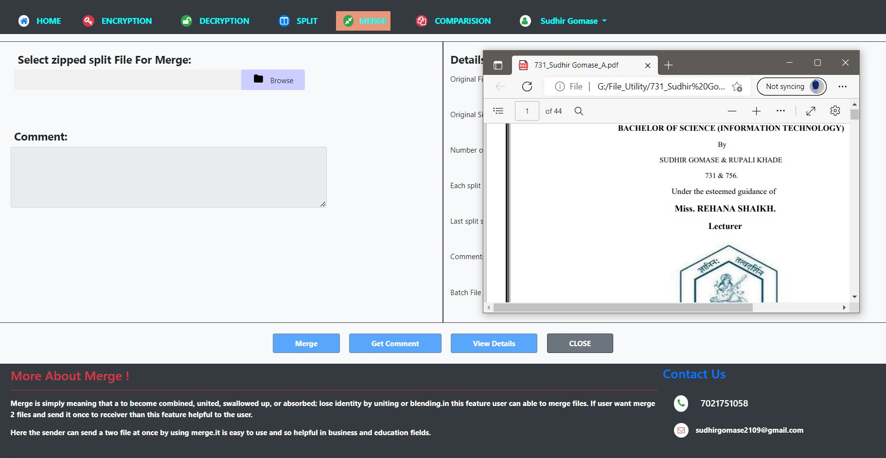

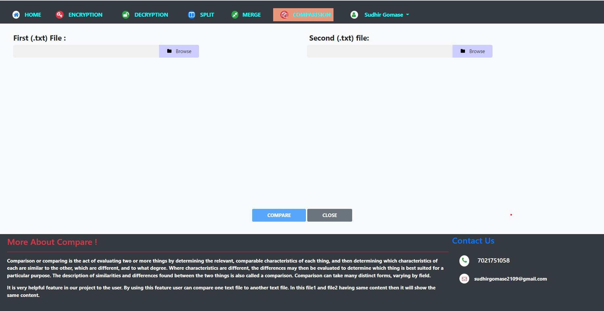

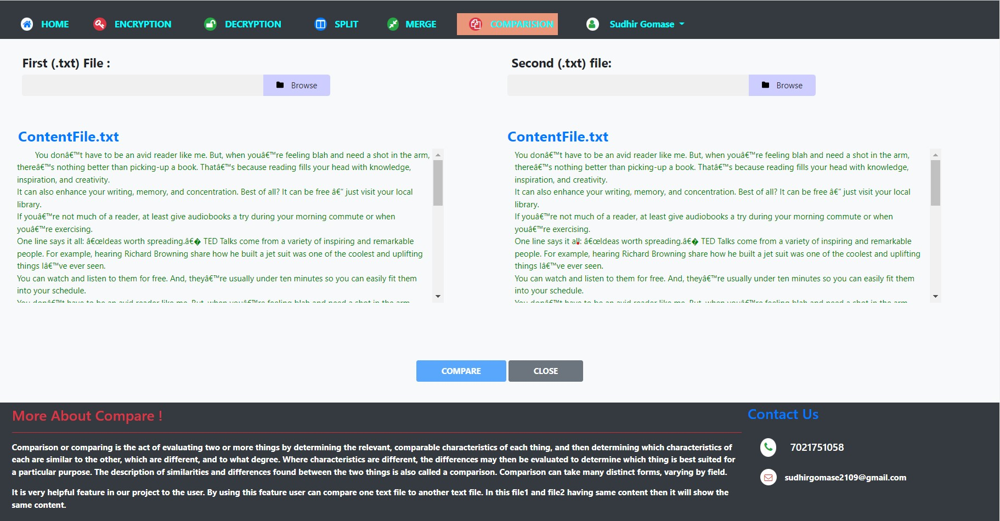

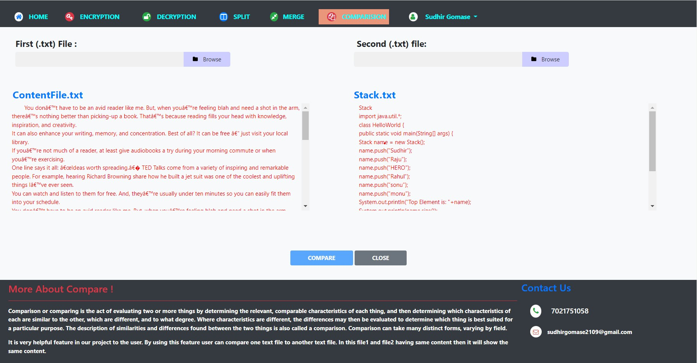

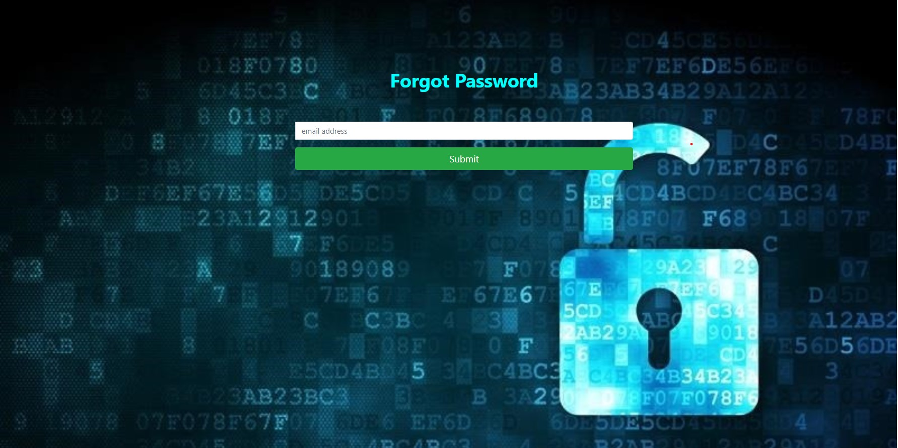

